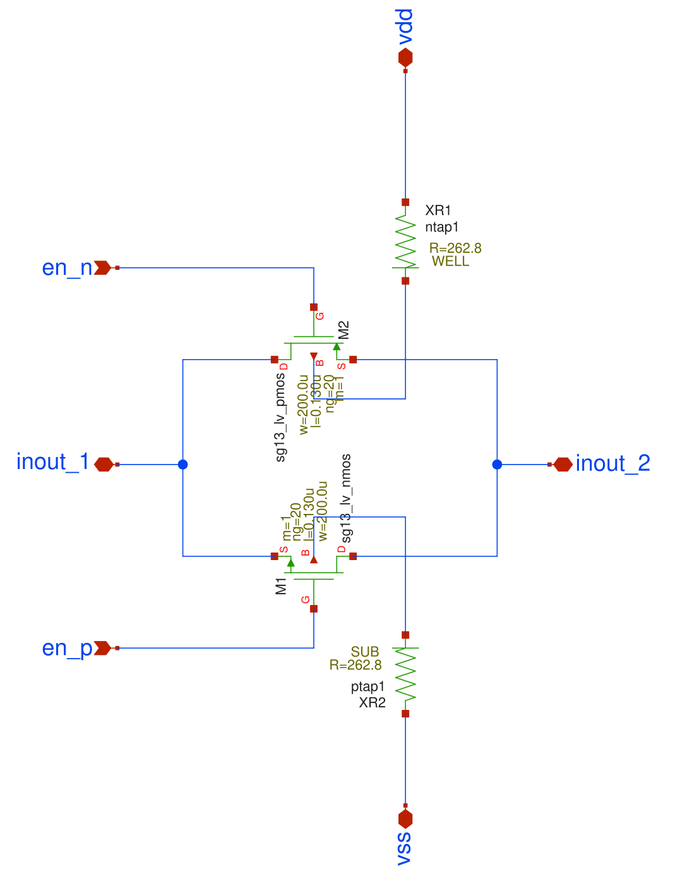
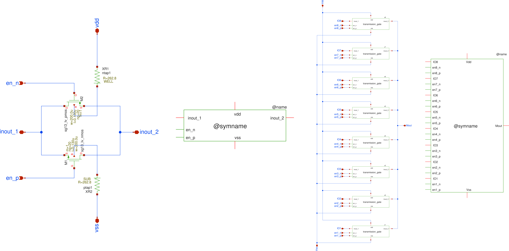
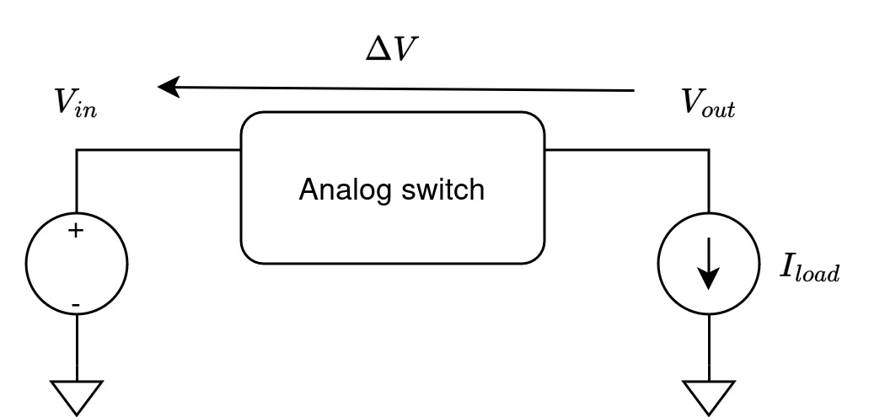
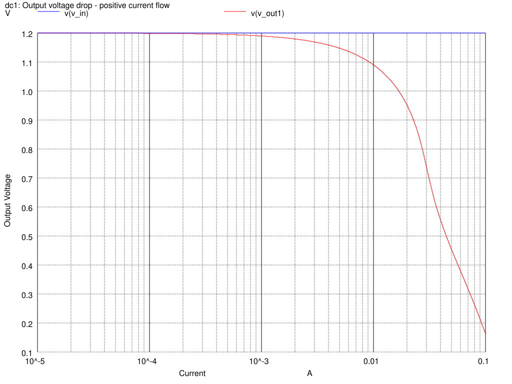
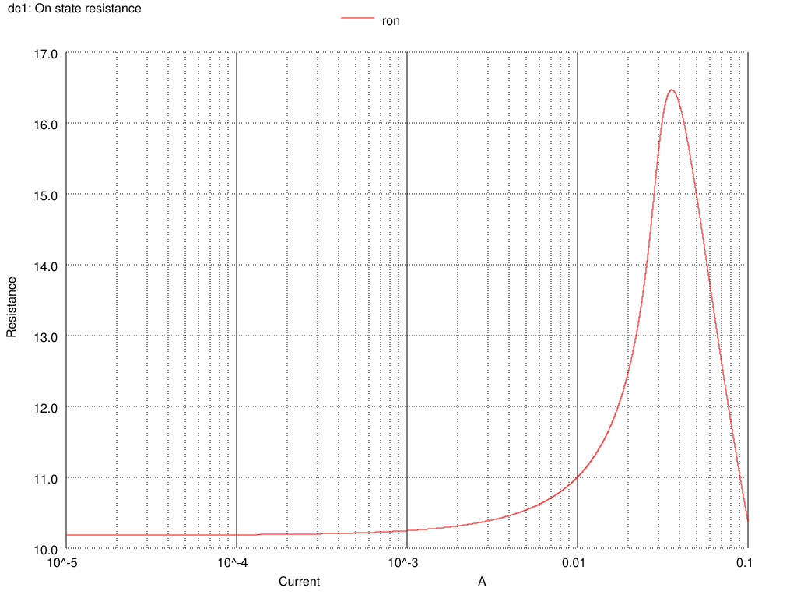

Analog Interface
-------------------

The analog part cosist of eight trasmission gates isolated by a dedicated guard ring,
what should improve isolation between channes. The basic schematic of a trasmission gate 
is shown below

A complete module of the multiplexer is presented on the following figure, where a symbol for a basic 
module of the gate and symbol for multiplexer were used in order to abstract the circuit.

Design Steps
-------------

The principal parameter o the analog switch is it's on-state resistance, which limits the maximum current of the device. 
Assuming the maximum voltage drop of :math:`\Delta V` @ :math:`I_{max}` load current one can calculate the respective resistance
using simple Ohms law :math:`R_{ON} = \frac{\Delta V}{I_{max}}`

In our case the maximum input voltage is 1.2 V so assuming 10% of the voltage drop @ maximum current of 10 mA we can derive 12 Ohm 
on state resistance. See te following figure:

For the MOSFET transistor the static  channel resistance can be calculated as  :math:`R_{DSON} = \frac{V_{DS}}{I_{DS}}`.
So in order to calculate the transistor size we have to calculete the device current, in this case :math:`I_{DS} = \frac{V_{DS}}{R_{ON}}`
:math:`I_{DS} = \frac{1.2}{12} = 0.1 mA`.  One single device of a unit width of 1 um  and length of 0.13 um can handle approx 400 uA of current so in order to get 
the 100 mA we have to increase th width 250 times. Since the allowed value of a unit finger width is 10 um we have to create  multifinger device by applying ng=25. 

Sweeping the load curent form 10u to 100 mA one can get the value of the on state resistance shown below:

