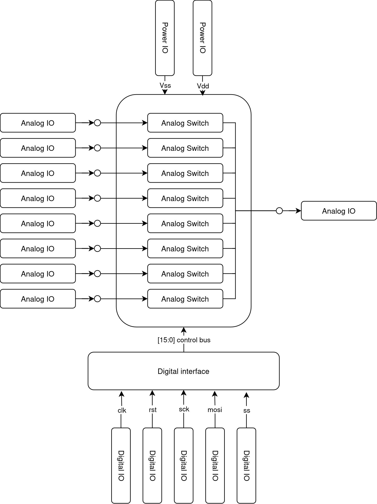

Architecture of the analog multiplexer chip
===========================================

The chip level architecture of the multiiplexer is shown on the figure below

The circuit consist of eight analog switches (transmission gates), digital interface based on SPI bus
and respective IO cells. The detailed description of the building blocks will be presented in the following 
subsections.

.. toctree::

   analogiface
   digitaliface
   
