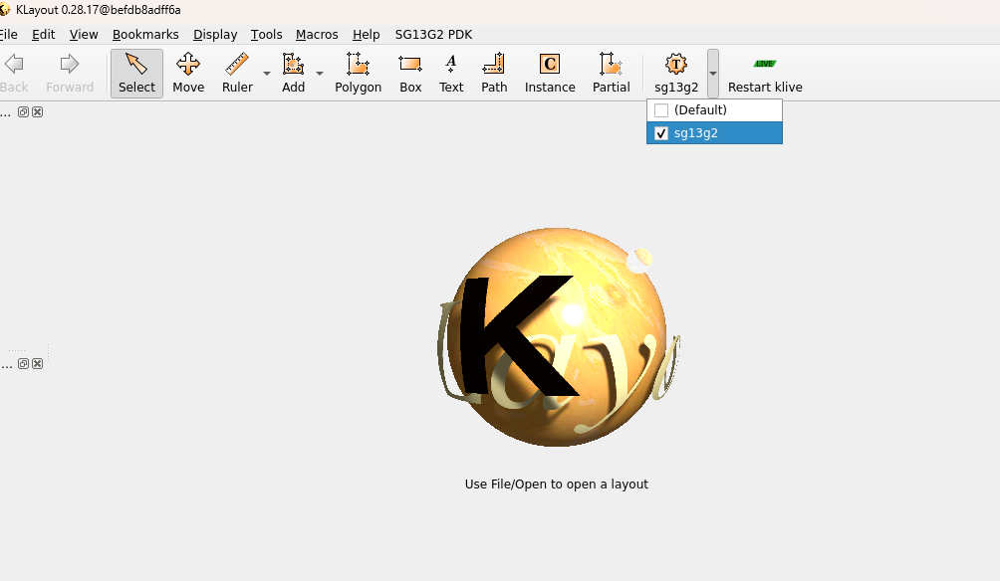
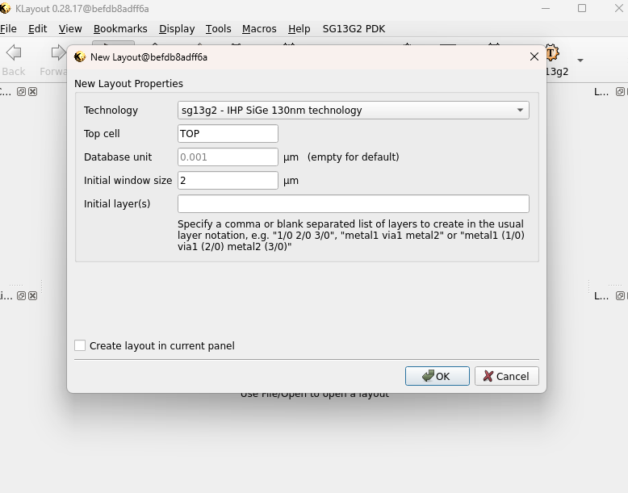
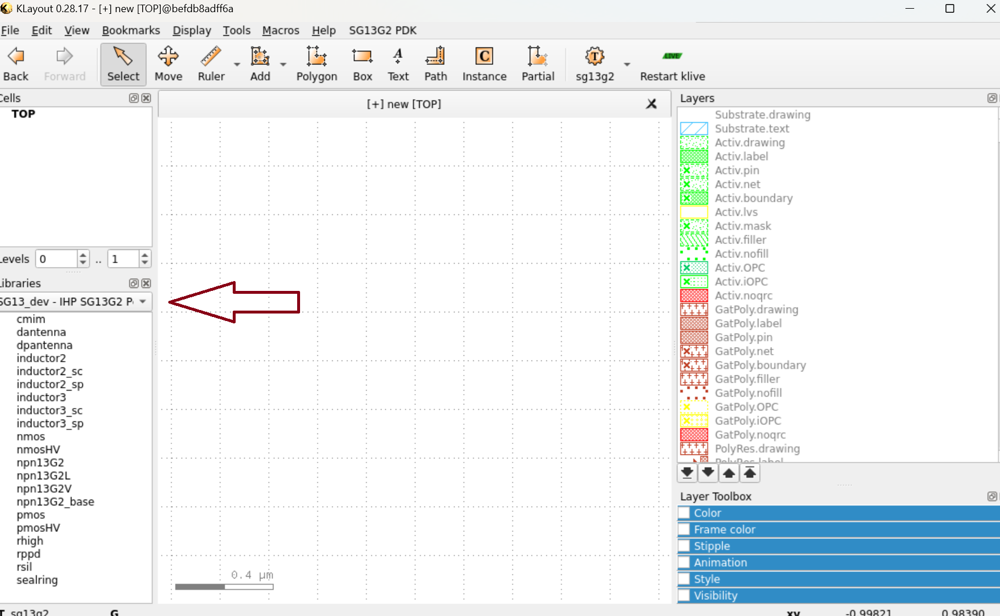
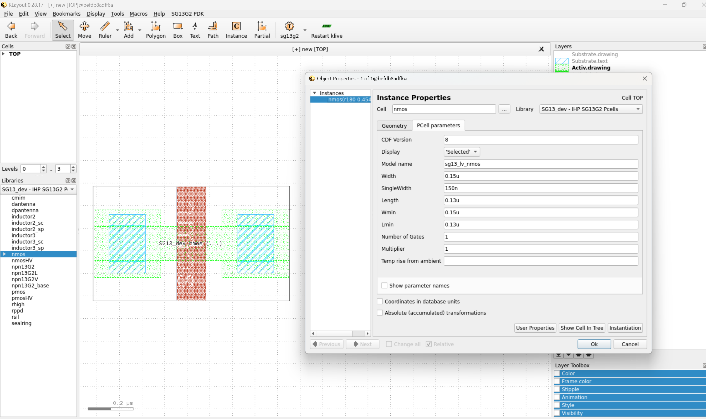
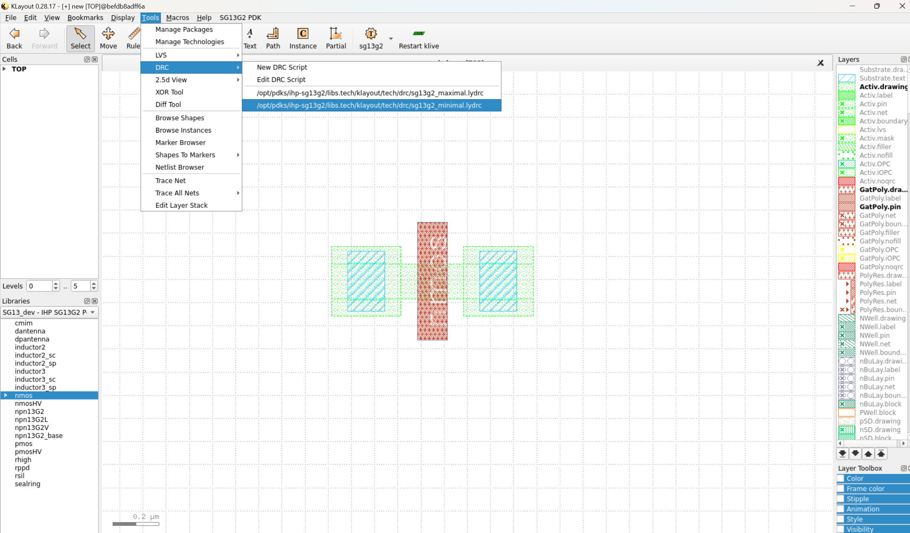
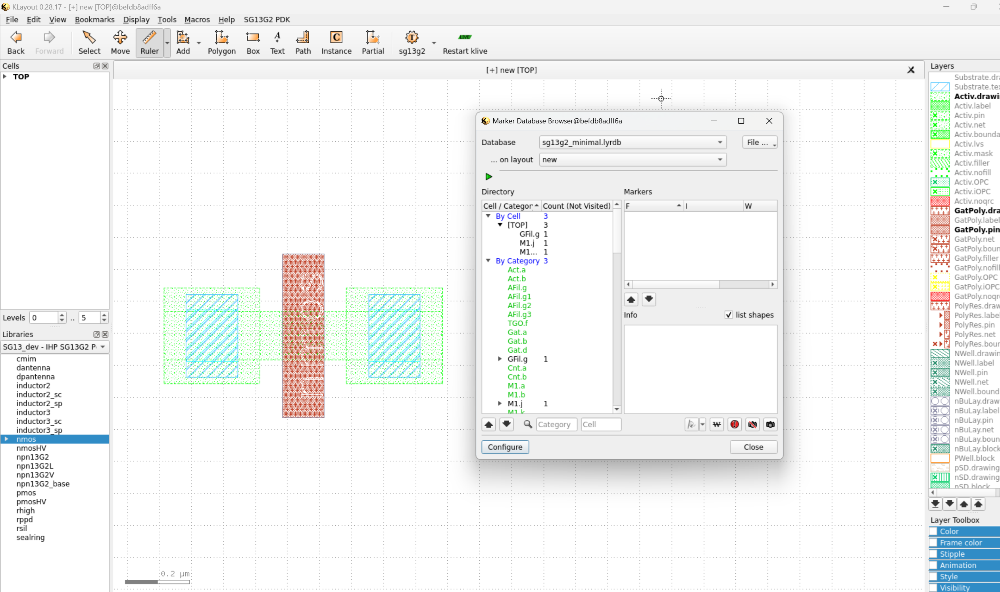
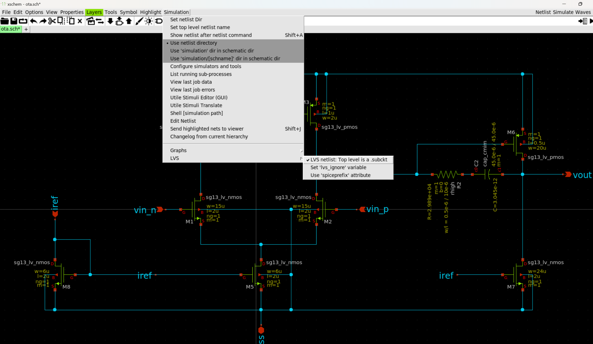
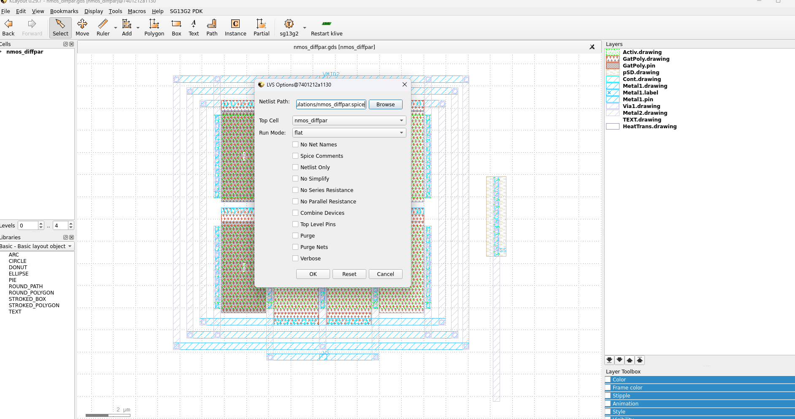
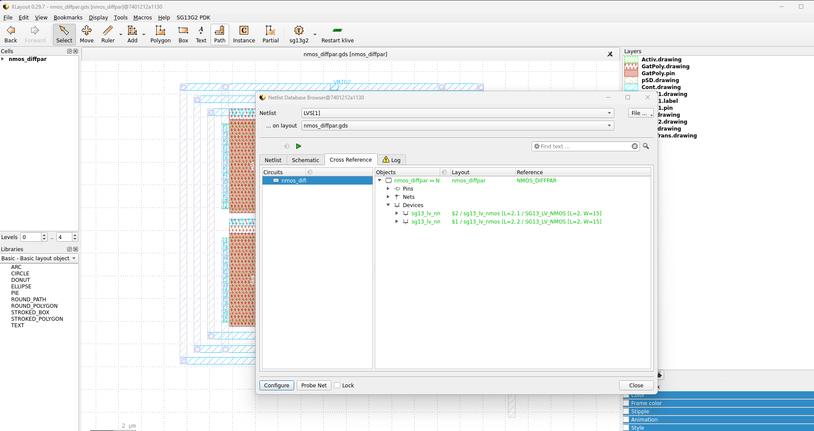

Layout design using Klayout
=============================

In this workshop, we will explore the fundamentals of layout design for mixed-signal microelectronics using KLayout, an open-source layout editor. Utilizing the IHP SG13G2 PDK, we will ensure our designs meet the necessary fabrication requirements, guiding you through the essential steps to create and verify layouts for manufacturing.

Parametric Cells
----------------

PCells, or Parameterized Cells, are reusable layout components that can be customized by adjusting parameters such as width, length, or device type. This allows designers to efficiently create and modify layout elements without redrawing them from scratch.

Instantiating PCells in KLayout:

1. Open KLayout in edit mode using:

.. code-block:: bash
    
    klayout -e

2. Change the technology from 'Default' to 'sg13g2':

3. Now you need to create a new layout. To do this, go to the File tab and select New Layout. Make sure to choose the correct technology by verifying that it is IHP SG13G2, and then click OK to proceed. 

4. The next step is to select the PCell library from the window at the bottom left. A list of all available PCells will appear.

5. To instantiate a PCell, simply select the desired PCell and drag it into the workspace. Once instantiated, you can modify its parameters by double-clicking on the PCell.

Design Rule Checks
------------------

Design Rule Checks (DRC) are essential in ensuring that your layout complies with the manufacturing rules of the foundry. These rules define the minimum spacing, width, and other geometrical constraints that must be followed to ensure a successful fabrication.

1. To run the DRC check, go to the Tools tab, select DRC, and then choose the Minimal or Maximal Verification file.

2. To view the DRC results, go to the Tools tab and select Marker Browser. In the pop-up window, choose the corresponding database.

Layout vs. Schematic
--------------------

LVS (Layout vs. Schematic) is a verification step that ensures your layout matches the schematic at a netlist level. This step is crucial in confirming that the physical layout correctly represents the intended design functionality.

1. First, you need to correctly extract the netlist from Xschem. To do this, open your schematic in Xschem, go to the Simulation menu, select LVS, then choose the LVS Netlist option, and make sure to uncheck the Use SpicePrefix option.

2. Now, navigate to the SG13G2 PDK tab and click on SG13G2 LVS Options. In the pop-up window, enter the path of the netlist file that you want to use for the LVS check.

3. Finally, in the same SG13G2 PDK tab, select Run KLayout LVS. The LVS process will begin, and a window displaying the results will appear once it’s complete.

