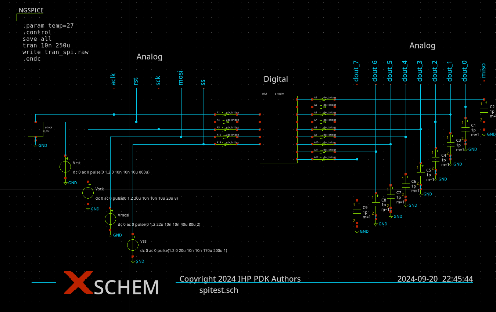
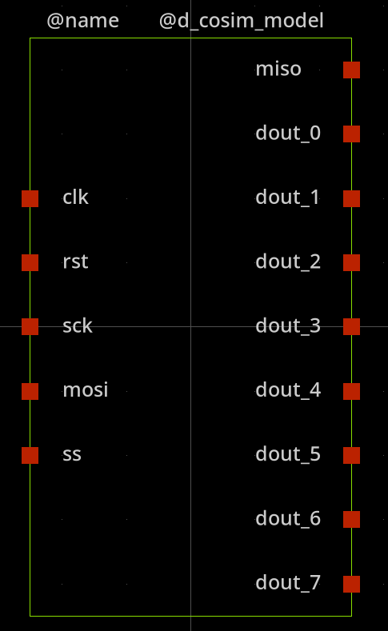

Schematic capture
==================

The cruitial part of the schematic is the symbol of the digital module  which shoulf ``pin to pin`` compatible with the verilog module.
It is important to ensure the correct order of the input/output pins. The buses are not supported so it should de expanded to a binary signals in the 
spice netlist as shown below:

Verilog module defintion:

.. code-block:: verilog

  module control(
    input clk,
    input rst,
    input sck,
    input mosi,
    input ss,
    output miso,
    output [7:0] dout
  );

Xschem symbol defintion ``*.sym``:

.. code-block:: bash

   format="@name [ @@clk @@rst @@sck @@mosi @@ss ] [ @@miso @@dout_0 @@dout_1 @@dout_2 @@dout_3 @@dout_4 @@dout_5 @@dout_6 @@dout_7  ] null @dut 

The graphical representation of the symbol is shown below

