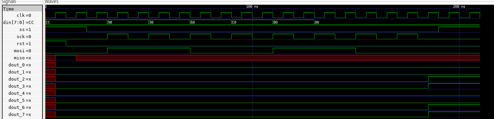
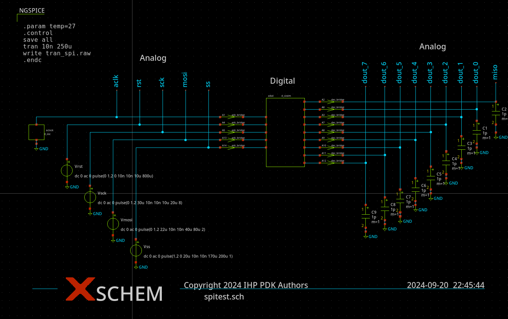
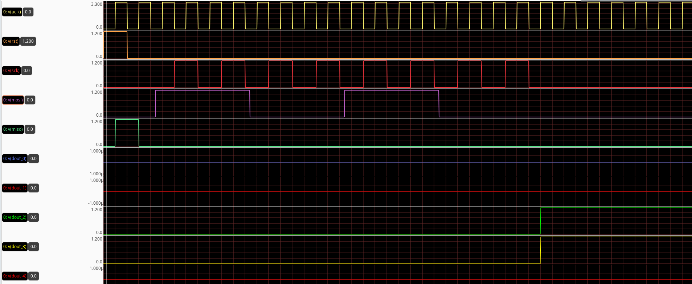

Simulation
===========

Each f
digital block can be abstracted in the ngsimulation unsing a subcircuit, which instantiates a 
device using a behevioral model elaborated using ``verilator``. 

.. code-block:: spice

  .subckt digital_block ain1 ain2 ain3 aout1 aout2

  acomp [ainp1 ainp2 ainp3] [inp1 inp2 inp3] comparator
  .model comparator adc_bridge in_low=0.2 in_high=1.0

  adut [inp1 inp2 inp3] [out1 out2] null dut
  .model dut d_cosim simulation="./top.so"

  abridge1 [out1 out2] [aout1 aout2] dac1
  .model dac1 dac_bridge(out_low = 0.0 out_high = 1.2 input_load = 5.0e-12 t_rise = 5e-9 t_fall = 2e-9)

  .ends 

The ADC and DAC bridges have to bi used in order to cross between tha domains.

The digital module can be alaborated using either Verilator (recommended) or Iverilog.
After a successful validation of a adigital module one can execute the following command in order to 
prepare a shared library, which can be used during the ngspice simulation. 

.. code-block:: bash

  ngspice vlnggen top.v 

The XSPICE extension of ngspice provides various elements, which simplify modeling and simulation of the 
mixed signal circuit. The ``d_osc`` can be used to instantiate a clock source as shown in the following example 
where the net ``clk`` is driven by a 100kHz source.

.. code-block::

  aclock 0 clk clock
  .model clock d_osc cntl_array=[-1 1] freq_array=[100k 100k]

Simulation of a SPI module in digital an mixed signal domains
--------------------------------------------------------------

A  simulation of the digital block which contains SPI module  can be performed using ``iverilog`` and ``GtkWave``. 
The testbench will generate respective control signals includeing ``clk``, ``sck``, ``ss`` and ``rst`` and also will
propagate serial data throught ``mosi`` line. 

.. code-block:: bash 
  
  iverilog -o ctrl.out control.v spi.v control_tb.v 
  vvp ctrl.out
  gtkwave control_tb.vcd
  

The generated signals can be observed on the following image:

In order to simulate the same circuit in the mixed signal domain one should use the ``d_cosim`` XSPICE module 
in the ``ngspice`` simulation. The first step is to generate a shared object which will be used by this module 
during the simulation. It can be made by calling the following:

.. code-block:: bash 
  
  ngspice vlnggen control.v 

The following image shows  a complete schematic which instantiates SPI module and generates appropiate signals in 
order to drive the digital module inputs. 

The transient simulation results are stored in ``tran_spi.raw`` file which can be opened by ``GAW`` waveform viewer as shown below: 

