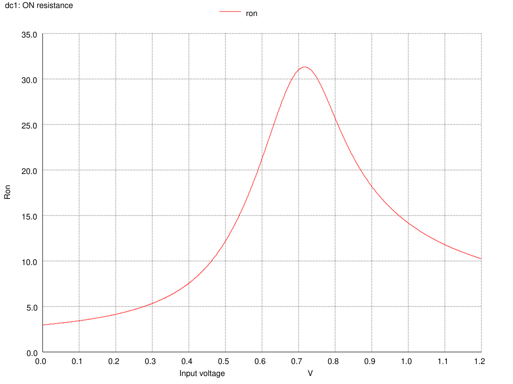

Testbenches 
============

In order to simulate the circuits behavior and extract the specified circuits parameters to be compared 
with the initial specification a set of testbenches have to be created and executed. 
A good review of the testbenches and parameters deiinition can be found in the documents
Analog multiplexer form MAXIM  :download:`MAX14778 <_static/MAX14778.pdf>`
Analog multiplexer form AD  :download:`ADG1634l <_static/adg1634l.pdf>`

On-Resistance 
--------------

The ON resistance, being one of the most important parameters of an analog multiplexer 
can be measured as a function output voltage and temperature for different load currents 
(typlically Imax).
The testbench for the simulation is set as follows:

The control section of te spice simulation is shown below.

.. code-block:: spice

  .param temp=27
  .param Iload=1m
  .control
  save all 
  dc Vin 1m 1.2 1m
  let Ron=(V(V_in)-V(V_out2))/0.001
  write dc_RON.raw
  set hcopydevtype=svg
  set color0=white
  set color1=black
  set color2=red
  set color3=blue
  set color4=green
  hardcopy Ron.svg Ron title "ON resistance" xlabel "Input voltage" ylabel "Ron"
  hardcopy Lin.svg V_in V_out1 V_out2 title "Gate linearity" xlabel "Input voltage" ylabel "Outputs" ylimit 0 1.2
  .endc

The results of the simulation for the load current of ``Iload = 1 mA`` are shown below

On-state resistance

Circuits linearity

.. note::

  The simulations were performed for bidirectional operation of the gate by instantiation of two identical gates 
  and application of the input stimuli on each ``inout``. Thus there are two output signals namely: ``V_out1`` and ``V_out2``

The following code in spice setup a teperature sweep in order to extract the dependence of on-state resistance. 

.. code-block:: spice

  .param temp=27
  .param Iload=1m
  .control
  save all 
  dc temp -40 125 1
  let Ron=(V(V_in)-V(V_out2))/0.001
  write dc_RON_temp.raw
  set hcopydevtype=svg
  set color0=white
  set color1=black
  set color2=red
  set color3=blue
  set color4=green
  hardcopy Ron_temp.svg Ron title "ON resistance vs temperature" xlabel "Temperature" ylabel "Ron"
  .endc

Leakage Current 
----------------

OFF state input and output leakage currents and ON state 
input leackage current can be measured using simple operational
point analysis and also as a function of temperature.

The following figure shows a testcase for evaluation of off-state (left) and on-state right leakage currents.

.. warning::

  As shown on the picture the control signals ``en_p`` and ``en_n`` are connected to the invalid pins. Thus we acheive 
  an on-state using the same control sources. 

The respective spice control code is shown below:

.. code-block:: spice

  .param temp=27
  .control
  save all 
  op
  echo Off state leakage currents
  echo output current 
  print I(Vp1) 
  echo input current
  print I(Vp2)
  echo On state leakage current
  print I(Vp5)  
  write op_Ileak.raw
  .endc

The result of the output is shown below:

.. code-block:: bash

  Off state leakage currents
  output current
  i(vp1) = 1.935061e-08
  input current
  i(vp2) = 1.934600e-08
  On state leakage current
  i(vp5) = 1.714779e-09

The temperature dependency of the leakage currents was evaluated using the same testbench and the following control code

.. code-block:: spice

  .param temp=27
  .control
  save all 
  dc temp -40 125 1
  write op_Ileak_temp.raw
  set hcopydevtype=svg
  set color0=white
  set color1=black
  set color2=red
  set color3=blue
  set color4=green
  hardcopy Ileakoff_temp.svg I(vp1) I(vp2) title "Off state leakage currents vs temperature" xlabel "Temperature" ylabel "Current"
  hardcopy Ileakon_temp.svg I(vp5) title "On state leakage current vs temperature" xlabel "Temperature" ylabel "Current"
  .endc

The results are the following:

Digital interface parameters
-----------------------------

The interface should be compatible with :download:`JEDEC <_static/jedec.pdf>`
specification.

Time domain parameters
--------------------------

The time domain parameters such as: turn on/off time, Break-Before-Make time, and 
charge injection can be directly measured using transient analysis and .MEAS command. 

The turn on/off time was evaluated using the following testbench:

.. code-block:: spice
 
  .param temp=27
  .control
  save all
  tran 10p 150n
  meas tran turn-On TRIG v(en_p) VAL=0.6 RISE=1 TARG v(v_out) VAL=1.1 RISE=1
  meas tran turn-OFF TRIG v(en_p) VAL=0.6 FALL=1 TARG v(v_out) VAL=0.1 FALL=1
  write tran_ton-off.raw
  set hcopydevtype=svg
  set color0=white
  set color1=black
  set color2=red
  set color3=blue
  set color4=green
  hardcopy turn-on-off1.svg en_p v_out title "Turn On/Off time" xlabel "time" ylabel "voltage"
  hardcopy turn-on-off2.svg v_in v_out title "Turn On/Off time" xlabel "time" ylabel "voltage"
  .endc

The console output with the respective values of ``turn-on`` and ``turn-off`` parameters are shown below:

.. code-block:: bash

  turn-on             =  4.252918e-11 targ=  5.004303e-08 trig=  5.000050e-08
  turn-off            =  2.999960e-08 targ=  1.300011e-07 trig=  1.000015e-07

.. Note::

  Since the digital interface is based on SPI, where the value of the control signals is updated in one clock cycle 
  there is no real sense to apply the Break-Before-Make time analysis.

The charge injection was evaluated using the following setup:

.. code-block:: spice

  .param temp=27
  .control
  save all
  tran 10p 150n
  write tran_cinject.raw
  set hcopydevtype=svg
  set color0=white
  set color1=black
  set color2=red
  set color3=blue
  set color4=green
  hardcopy cinject1.svg v_out  title 'Output voltage' xlabel 'time' ylabel 'voltage'
  hardcopy cinject2.svg en_p   title 'Control signal' xlabel 'time' ylabel 'voltage'
  .endc

The output signals are shown below:

.. warning::

  Although the value ov the charge injection can be calculated as  a simple product of  :math:`Q_j = C_{out} \cdot \Delta V` it seems 
  that in this case the simulation does not deliver realistic results. 

Frequency domain parameters
-----------------------------

The circuit bandwidth can be determined by using a S-parameter analysis, decade sweep 
of an input singal in ON state. The .MEAS command can be also used in order to determine the 
-3 dB cut-off frequency. 

.. code-block:: spice

  .param temp=27
  .options noacct
  .control
  save all 
  sp dec 101 10Meg 10G 0
  meas ac s21 FIND s_2_1 AT=100MEG
  let dbs21=0.707*s21
  meas ac freq_at when s_2_1=dbs21
  write offisolation.raw
  set hcopydevtype=svg
  set color0=white
  set color1=black
  set color2=red
  set color3=blue
  set color4=green
  hardcopy Bandwidth.svg s_2_1  title "Transfer function" xlabel "frequency" ylabel "S_21" xlog
  .endc

The console output is as follows:

.. code-block:: bash
 
  s21                 =  9.709062e-01
  freq_at             =  6.651288e+09

.. note::

  The evaluation of the ``-3 dB`` frequency has to be performed in two step using ``.meas`` command. First a nominal value at norminal frequency (flat zone)
  is evalated and then in the secon step a value of a frequency ``freq_at`` is determined for a -3 dB (0.707) drop of the sonminal value. qq

The  result of the simulation is shown below:

The off-isolation can be evaluated using the same testbench. The only differenece is the state of the control sources in order to open the 
transmission gate. Once done the parameter can be measured.

.. code-block:: spice

  .param temp=27
  .options noacct
  .control
  save all 
  sp dec 101 10Meg 10G 0
  meas ac s21 FIND s_2_1 AT=100MEG
  let dbs21=20*log10(-s21)
  print dbs21
  write offisolation.raw
  set hcopydevtype=svg
  set color0=white
  set color1=black
  set color2=red
  set color3=blue
  set color4=green
  hardcopy off-isol.svg s_2_1  title "Transfer function" xlabel "frequency" ylabel "S_21" xlog
  .endc

The console output is as follows:

.. code-block:: bash

  s21   = -2.071968e-05
  dbs21 = -9.36723e+01

The plot of the S21 parameter for the off-state is shown below

The Power Supply Rejection Ratio can be also measured as a function of frequency. 

This time the swithc is evaluated in on-state and the input small signal source is the ``Vpwr`` one, 
what simulates injection of a small signal through the power line ``Vdd``.

.. code-block:: spice

  .param temp=27
  .options noacct
  .control
  save all 
  ac dec 101 1Meg 10G 
  meas ac vout_at FIND vout AT=100MEG
  let PSRR=20*log10(-vout_at)
  print PSRR
  write psrr.raw
  set hcopydevtype=svg
  set color0=white
  set color1=black
  set color2=red
  set color3=blue
  set color4=green
  hardcopy psrr1.svg vout  title "Power supply transfet function" xlabel "frequency" ylabel "Vout" xlog
  .endc

The console output is as follows:

.. code-block:: bash
  
  vout_at  =  -3.085801e-04
  psrr     =  -7.02126e+01

The plot of the output voltage for the on-state is shown below

Noise and distortion parameters
--------------------------------

The current state of the tools: ngspice/Xyce allow to estimate only small signal nosie introduced by the components. 
Usually the noise is presented as a noise spectral density fuction in the frequency domain in the limited frequency range. 

The basic testbench for noise evaluation is shown below:

The control section which drives the noise simulation is the follwing one:

.. code-block:: spice

  .param temp=27
  .control
  save all 
  noise V(V_out) Vin dec 1001 10 10G
  setplot noise1
  set hcopydevtype=svg
  set color0=white
  set color1=black
  set color2=red
  set color3=blue
  set color4=green
  hardcopy noise1.svg onoise_spectrum  title "Output noise spectrum" xlabel "frequency" ylabel "Vout" xlog
  setplot noise2
  print onoise_total
  .endc

.. warning::

  The ``noise`` analysis outputa vector and scalar values of the input or output reffered noise. 
  In order to get the valid values one have to use ``setplot noise1/2`` command in order to access the data stored in 
  the variables ``o(i)noise_total`` or ``o(i)noise_spectrum``

The total integrated (from fmin to fmax) output noise value reported by ngspice is equal to: 

.. code-block:: bash
  
  onoise_total = 2.183359e-05

The value is in volts.

The output value of the noise spectral density is presented on the following figure

One have to notice that the y-axis is scaled in :math:`V/\sqrt{Hz}` 

Corner analysis
------------------
CACE 

Temperature analysis
----------------------
CACE 

