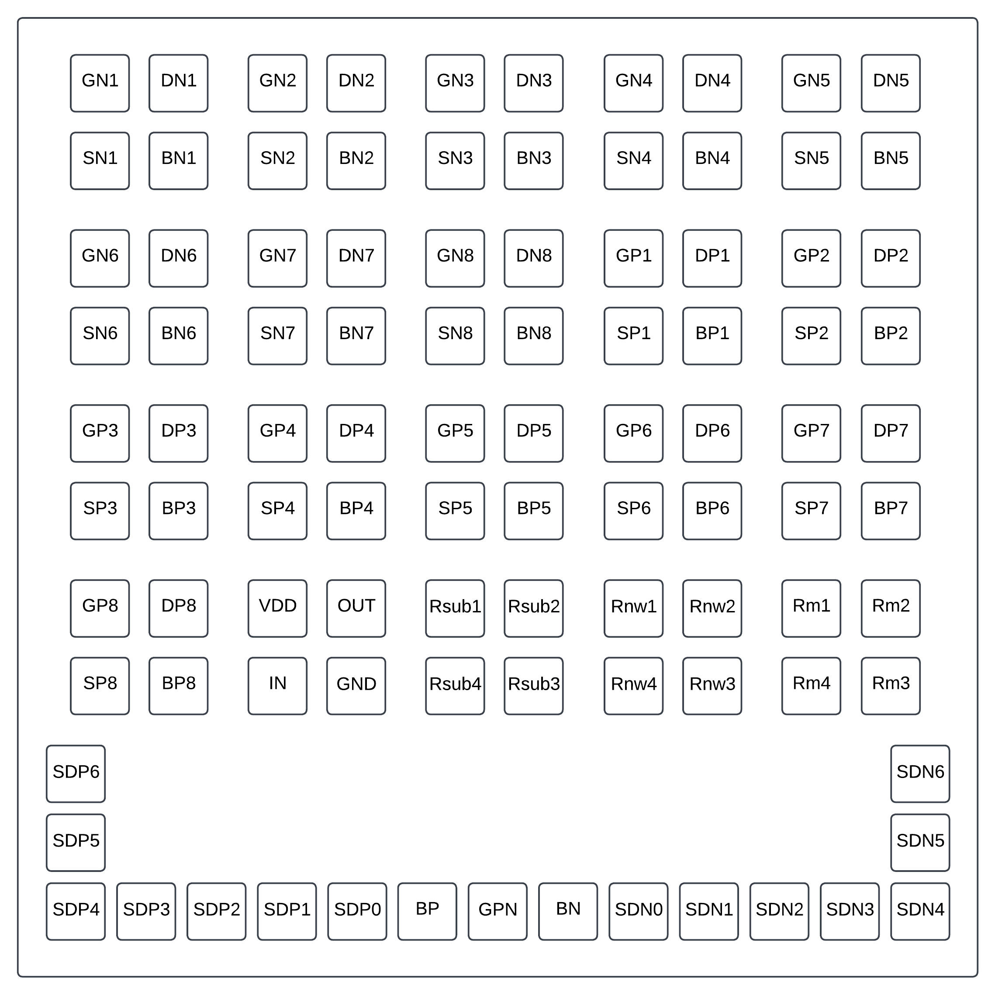

Specification of the CryoChip
###################################

Understanding the operation of electronic circuits applied in low-temperature environments is crucial for the implementation of systems aimed at quantum computing. This is because, in cryogenic environments, material properties and device behavior can differ significantly from those observed at conventional temperatures.

To characterize circuits at both conventional and cryogenic temperatures, a chip was developed to test the behavior of the designs proposed below.

-	8 NMOS transistors (various sizes)
-	8 PMOS transistors (various sizes)
-	A structure with 6 NMOS and 6 PMOS transistors for characterization measurements
-	1 inverter
-	3 resistivity measurement devices based on the Van der Pauw structure

The chip was configured to allow individual analysis of the designs, with all terminals used presented in the section below.

Chip Pinout
###########

NMOS Transistors:

-	GP1, GP2, GP3, GP4, GP5, GP6, GP7, GP8: Gate terminal of the transistor
-	DP1, DP2, DP3, DP4, DP5, DP6, DP7, DP8: Drain terminal of the transistor
-	SP1, SP2, SP3, SP4, SP5, SP6, SP7, SP8: Source terminal of the transistor
-	BP1, BP2, BP3, BP4, BP5, BP6, BP7, BP8: Bulk terminal of the transistor

PMOS Transistors:

-	GP1, GP2, GP3, GP4, GP5, GP6, GP7, GP8: Gate terminal of the transistor
-	DP1, DP2, DP3, DP4, DP5, DP6, DP7, DP8: Drain terminal of the transistor
-	SP1, SP2, SP3, SP4, SP5, SP6, SP7, SP8: Source terminal of the transistor
-	BP1, BP2, BP3, BP4, BP5, BP6, BP7, BP8: Bulk terminal of the transistor

Inverter:

-	VDD: Power supply terminal of the inverter
-	IN: Input terminal of the inverter
-	OUT: Output terminal of the inverter
-	GND: Ground terminal of the inverter

Resistivity Measurement Devices:

-	Rsub1: Terminal 1 of the substrate resistor
-	Rsub2: Terminal 2 of the substrate resistor
-	Rsub3: Terminal 3 of the substrate resistor
-	Rsub4: Terminal 4 of the substrate resistor

-	Rnw1: Terminal 1 of the n-well resistor
-	Rnw2: Terminal 2 of the n-well resistor
-	Rnw3: Terminal 3 of the n-well resistor
-	Rnw4: Terminal 4 of the n-well resistor

-	Rm1: Terminal 1 of the metal1 resistor
-	Rm2: Terminal 2 of the metal1 resistor
-	Rm3: Terminal 3 of the metal1 resistor
-	Rm4: Terminal 4 of the metal1 resistor

NMOS and PMOS Characterization Structure:

-	GPN: Common gate terminal of the NMOS and PMOS transistors
-	BN: Common bulk terminal of the NMOS transistors
-	BP: Common bulk terminal of the PMOS transistors 

-	SDN0: Source terminal of the NMOS transistor
-	SDN1: Source-Drain terminal of the NMOS transistor
-	SDN2: Source-Drain terminal of the NMOS transistor
-	SDN3: Source-Drain terminal of the NMOS transistor
-	SDN4: Source-Drain terminal of the NMOS transistor
-	SDN5: Source-Drain terminal of the NMOS transistor
-	SDN6: Drain terminal of the NMOS transistor

-	SDP0: Source terminal of the PMOS transistor
-	SDP1: Source-Drain terminal of the PMOS transistor
-	SDP2: Source-Drain terminal of the PMOS transistor
-	SDP3: Source-Drain terminal of the PMOS transistor
-	SDP4: Source-Drain terminal of the PMOS transistor
-	SDP5: Source-Drain terminal of the PMOS transistor
-	SDP6: Drain terminal of the PMOS transistor
