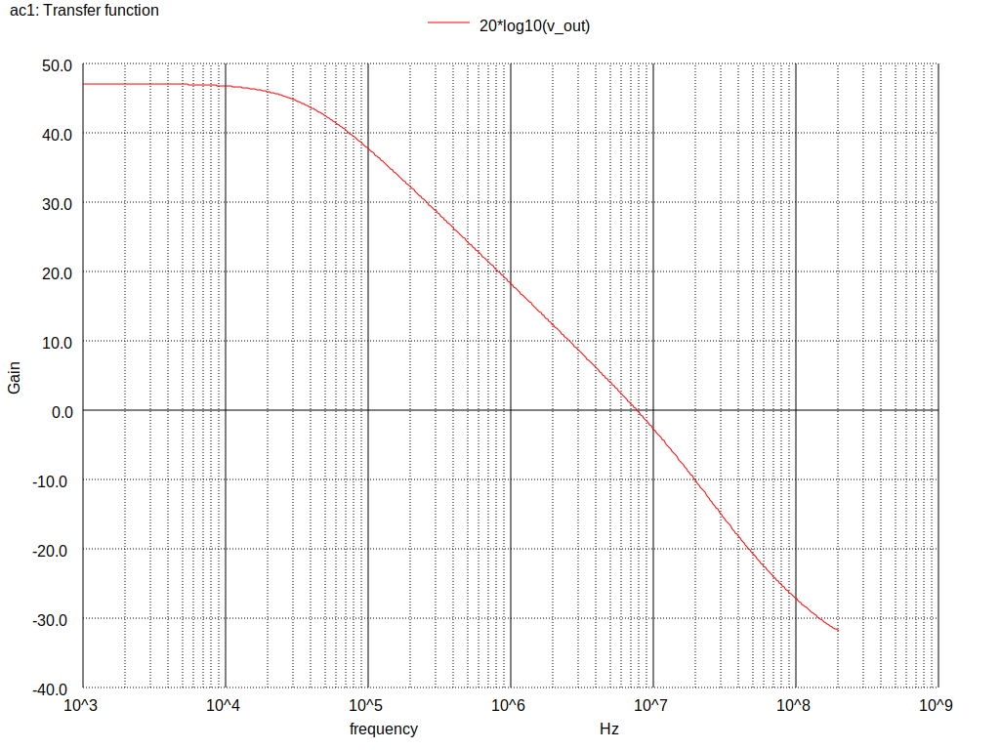
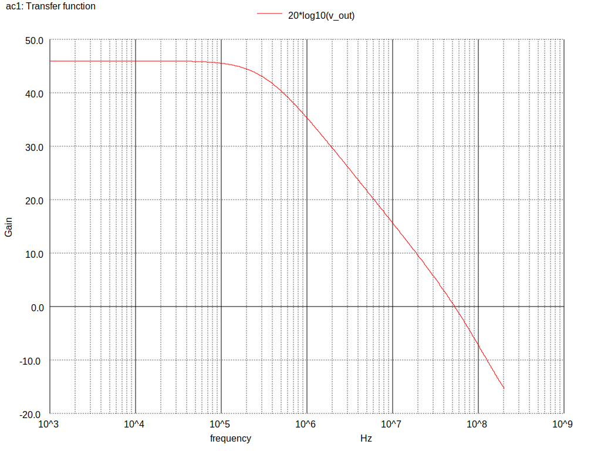
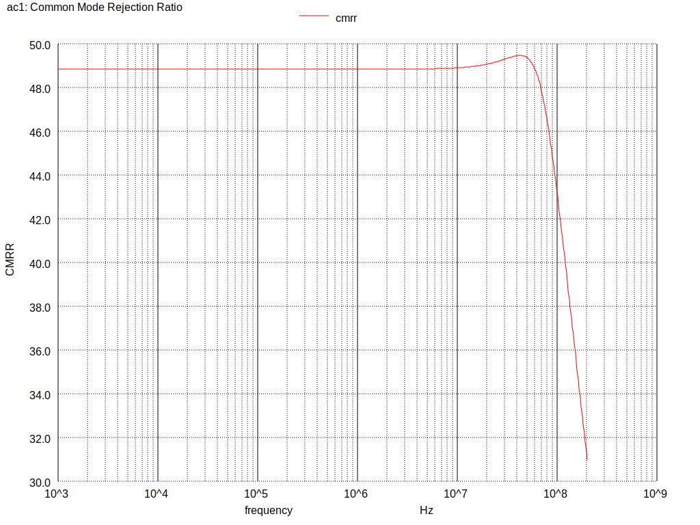

Design data and design process description
############################################

Gain vs frequency
***********************************

TT corner

- GBW: 111.40 MHz
- BW: 761.28 kHz
- Gain: 44.78 dB

FF corner

    
- GBW: 7.65 MHz
- BW: 36.33 kHz
- Gain: 47.07 dB

SS corner

- GBW: 143.8 MHz
- BW: 1.06 MHz
- Gain: 44.17 dB

SF corner

.. image:: _static/Pictures/AC/gain_sf.svg
    :align: center
    :alt: ngspice ac graph sf
    :width: 600

- GBW: 139.35 MHz
- BW: 1.01 MHz
- Gain: 44.34 dB

FS corner

    
- GBW: 45.97 MHz
- BW: 306.22 kHz
- Gain: 45.97 dB

CMRR
***********************************

TT corner

- CMRR: 49 dB

Transient analysis
*************************************

TT corner

- Turn on time: 1.61 us
