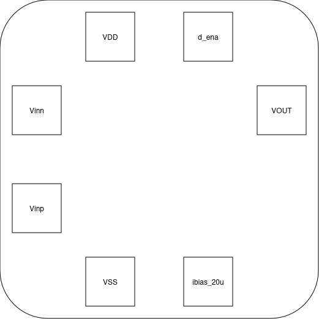

Specification of the Transconductance amplifier
###################################

Pinout
******************************************

    
- VDD: supply voltage (3.3 V)
- VSS: ground reference voltage
- Vinn: inverting input
- Vinp: non-inverting input
- d_ena: enable
- ibias_20u: bias current (20 uA)
- VOUT: output signal
