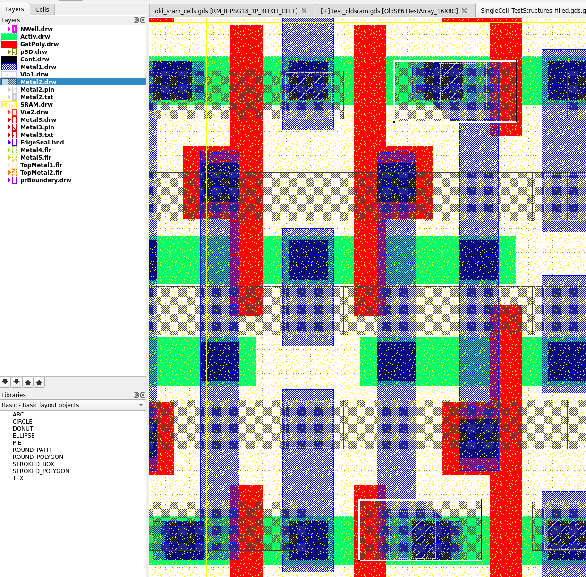
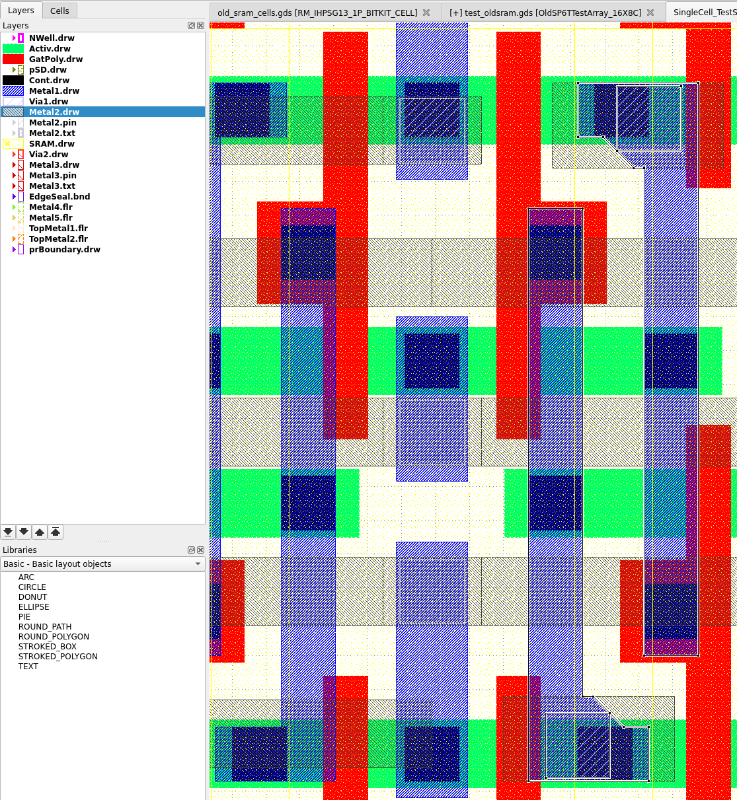

# Used SRAM rules

## Denser SRAM rules used for the dense SRAM layouts:

| Rule | regular | old | this |
|------|---------|-----|------|
| Gat.C | 0.18 | 0.13 | 0.15 |
| Cnt.c | 0.07 | (0.02, 0.07) | (0.02, 0.07) |
| pSD.i | 0.30 | 0.22 | 0.27 |
| pSD.j | 0.30 | 0.30 | 0.27 |
| NW.c | 0.31 | 0.27 | 0.27 |
| NW.d | 0.31 | 0.27 | 0.27 |

Description of the rules listed above:
* Gat.c: Min. GatPoly extension over Activ (end cap)
* Cnt.c: Min. Activ enclosure of Cont
* pSD.i: Min. pSD enclosure of PFET gate not inside ThickGateOx
* pSD.j: Min. pSD space to NFET gate not inside ThickGateOx
* NW.c: Min. NWell enclosure of P+Activ not inside ThickGateOx
* NW.d: Min. NWell space to external N+Activ not inside ThickGateOx

* Area is virtually the same:
  * old: 2.81µm x 1.07µm = 3,0067µm²
  * this: 2.78µm x 1.07µm = 2.9746µm²

## DRC violations to be waived

For the SNM measurement internal `bit` and `bit_n` signal of the SRAM cell needs to be connected out. In the smallest SRAM cells this could not be done by introducing some DRC violations that need to be waived:

* M2.d: Min. Metal2 area  
  See selected shapes in following image:
  
  The rule is 0.144µm², smallest area present in the structures is 0.1263µm²
* M1.c1.SRAM: Min. Metal1 endcap enclosure of Cont
  This at place as previous violation; see selected shape in following image (same place as previous)
  
  Here the enclosure is violating of the Via1 corner next to a 45deg Metal1 shape. The 45 degree line was introduced to not violate the Metal1 minimum spacing (M1.b) rule.

This is only for the connected out cell and for each of these cells a structure is also available with the internal signals not connected out and thus without those violations. In case the violation does cause actual problem during measurement one should still be able to verify functionality of the SRAM cell. The only thing which can't be done is measure the SNM of the cell.
