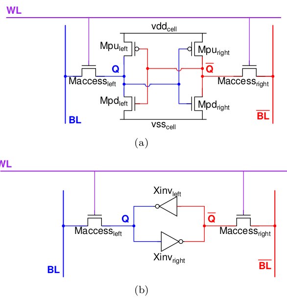
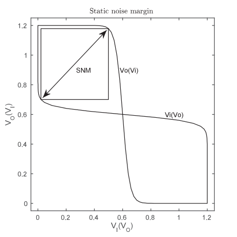

# Short test procedure description for single SRAM cell

A short description will be given here on the measurements to be done on the single SRAM cells. Main purpose is to try to give enough information to derive the requirements for the measurement setup and compatibility with equipment @ IHP.

## Test structure

A SRAM cell consists of a back-coupled inverter pair with (NMOS) access transistors. Above is the schema for 6 transistor (6-T) single port SRAM cell. Next to `vss` and `vdd` for the single cell we have three additional external signals: `WL`, `BL` and `BL_n`. For a specific measurement discussed further below also a version of the test structure is available where `Q` and `Q_n` are connected out.

For the dual port SRAM an extra set of access transistors is added. Which leads to `WL1`+`BL1`+`BL1_n` and `WL2`+`BL2`+`BL2_n` as external signals. Also here a structure is added with `Q` and `Q_n` connected out.

So the connected out dual port test array has 10 signal connections:
- `vss`
- `vdd`
- `WL1`
- `BL1`
- `BL1_n`
- `WL2`
- `BL2`
- `BL2_n`
- `Q`
- `Q_n`

## Precharge voltage

Before doing a read the bit lines are precharged to a certain voltage. This is also called the precharge voltage. In the compiler that is developed in this project the pre-charge voltage Vpre is currently Vdd. Ideally measurement allow though to do the measurements with Vpre lower than Vdd though also as that is a possible future low power improvement.

## Measurements

Typical metrics to be measured on single SRAM cell:

- hold static noise margin (SNMhold)
- read static noise margine (SNMread)
- write trip point (WTP)
- read current
- leakage

The test structure with the internal signals connected out is only needed for static noise margin measurement. It is preferred though that the other measurements are done both on
the non connected out and the connected out test structure to see if the connecting out has impact on the performance of the cell. It is not strictly necessary though.

### Static noise margin hold and read

The static noise margin is a data retention measurement as it measures how resilient the cell is to external interference. It is done by sweeping one of the internal signals and measuring the voltage on the other internal signal. Both sweep results are then plotted as in the picture above. In each of the lobes then a maximum size square is drawn and the smallest of these squares is called the SNM.

For simulation without including variability these lobes are symmetric but when including variability it is not.

SNMhold is then the measurement with `WL` closed (e.g. 0V) SNMread is with `WL` open (e.g. Vdd) and `BL`+`BL_n` forced to Vpre. More advanced SRAM blocks allow to be put in stand by mode where no read or write operation is performed and the supply voltage is reduced. The lowest voltage for standby is the supply voltage with which still a positive SNMhold is measured. This needs to be true for all cells including variability, e.g. likely high-sigma Monte-Carlo is needed to determine this and measurements on a lot of test stuctures to get good idea of distribution of SNMhold for a certain voltage.

SNMhold measurement procedure:
1. Connect ground to `vss` and supply to `vdd`
1. `WL` -> 0V, `BL` -> Vpre, `BL_n` -> Vpre
1. Sweep `Q` 0V -> Vdd, measure V on `Q_n` in high impedant state
1. Sweep `Q_n` 0V -> Vdd, measure V on `Q` in high impedant state

SNMread measurement procedure single port:
1. Connect ground to `vss` and supply to `vdd`
1. `WL` -> Vdd, `BL` -> Vpre, `BL_n` -> Vpre
1. Sweep `Q` 0V -> Vdd, measure V on `Q_n` in high impedant state
1. Sweep `Q_n` 0V -> Vdd, measure V on `Q` in high impedant state

SNMread measurement procedure dual port, two port read:
1. Connect ground to `vss` and supply to `vdd`
1. `WL1` -> Vdd, `BL1` -> Vpre, `BL1_n` -> Vpre  
   `WL2` -> Vdd, `BL2` -> Vpre, `BL2_n` -> Vpre
1. Sweep `Q` 0V -> Vdd, measure V on `Q_n` in high impedant state
1. Sweep `Q_n` 0V -> Vdd, measure V on `Q` in high impedant state

SNMread measurement procedure dual port, one port read:
1. Connect ground to `vss` and supply to `vdd`
1. `WL1` -> Vdd, `BL1` -> Vpre, `BL1_n` -> Vpre  
   `WL2` -> 0V, `BL2` -> Vpre, `BL2_n` -> Vpre
1. Sweep `Q` 0V -> Vdd, measure V on `Q_n` in high impedant state
1. Sweep `Q_n` 0V -> Vdd, measure V on `Q` in high impedant state

Computation of SNM can be done by rotating the measured curves by 45 degree and then compute maximum vertical distance between the rotated curves. If the curves don't intersect SNM is zero.

For dual port the two port read is worst case so procedure for measuring SNMread with only one port read is not strictly necessary.

### Write trip point

Designing SRAM cell is a trade-off between read performance and writability. The write trip point is a measurement for the writability. It is done by sweeping the voltage on `BL` and `BL_n` and see when the cell flips value.

WTP measurement procedure:
1. Connect ground to `vss` and supply to `vdd`
1. `WL` -> Vdd, `BL` -> Vpre, `BL_n` -> 0V (init bit value to 1)
1. `WL` -> 0V (close word line)
1. `BL_n` -> Vpre (pre-charge)
1. `WL` -> Vdd (open word line)
1. Sweep `BL` Vpre -> 0V, measure V on `BL_n` in high impedant state
1. `WL` -> 0V (close word line)
1. `BL` -> Vpre, `BL_n` -> Vpre (pre-charge)
1. `WL` -> Vdd (open word line)
1. Sweep `BL_n` Vpre -> 0V, measure V on `BL` in high impedant state

For dual port same procedure is done for each of `WL1`+`BL`+`BL_n` and `WL2`+`BL`+`BL_n`. Doing a write on both ports at the same time is undefined behaviour and does not need to be tested.

This procedure could also be split up into two measurements with each a sweep and initialization of the SRAM cell to the opposite value for the second sweep.

### Read current

Other design aspect of SRAM is the speed of operation for read. One aspect that contributes to this is the read current of the cell. This metric together with the capacitive load on the bit line will determine the speed with which the SRAM can discharge the bit line. This combined with the threshold of the sense amplifier circuit determines the time needed for a read operation.

Read current measurement procedure:
1. Connect ground to `vss` and supply to `vdd`
1. `WL` -> Vdd, `BL` -> Vpre, `BL_n` -> 0V (set bit value to 1)
1. (keep `WL` -> Vdd, `BL` -> Vpre) `BL_n` -> Vpre, measure current on `BL`, `BL_n`
1. `WL` -> Vdd, `BL` -> 0V, `BL_n` -> 0V (set bit value to 0)
1. (keep `WL` -> Vdd, `BL_n` -> Vpre) `BL` -> Vpre, measure current on `BL`, `BL_n`

### Leakage current/power

Leakage power is the power consumed when the SRAM is not doing any operation. In our current SRAM design the SRAM is pre-charging when not doing an operation. But there are also designs where the SRAM is not pre-charging at idle but only right before a read or write operation.

The test structures developed here are not ideal for measuring the leakage due to the limited cells available in one structure resulting in small leakage current, especially at room temperature. Other reason is that `BL` and `BL_n` are only connected to one column of the test array and the other bit lines are floating.

Full SRAM blocks are better for measuring leakage as they contain much more cells and thus increasing the leakage current. From the other side equipment that can measure IV curves of single transistors should also have the resolution to measure leakage from an array of SRAM cells.

Leakage measurement procedure single port, pre-charge:
1. Connect ground to `vss` and supply to `vdd`
1. `WL` -> 0V, `BL` -> Vpre, `BL_n` -> Vpre, measure current on `vdd`, `BL` and `BL_n`.  
   Leakage current is sum of the three currents, current on bit lines may be negative

Leakage measurement procedure single port, no pre-charge:
1. Connect ground to `vss` and supply to `vdd`
1. `WL` -> 0V, `BL` -> floating, `BL_n` -> floating, measure current on `vdd`

Leakage measurement procedure dual port, pre-charge:
1. Connect ground to `vss` and supply to `vdd`
1. `WL1` -> 0V, `BL1` -> Vpre, `BL1_n` -> Vpre,  
   `WL2` -> 0V, `BL2` -> Vpre, `BL2_n` -> Vpre,  
   measure current on `vdd`, `BL1`, `BL1_n`, `BL2`, `BL2_n`.  
   Leakage current is sum of all five currents, current on bitlines may be negative

Leakage measurement procedure dual port, no pre-charge:
1. Connect ground to `vss` and supply to `vdd`
1. `WL1` -> 0V, `BL1` -> floating, `BL1_n` -> floating,  
   `WL2` -> 0V, `BL2` -> floating, `BL2_n` -> floating,  
   measure current on `vdd`
