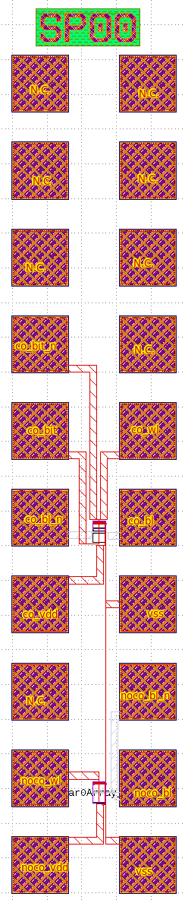
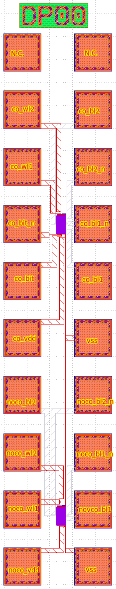

# PadFrame pin-outs

A 2x10 pad frame is used for both the SP6T and DP8T test structures. There is one pin-out for all SP6T structures and one pin-out for the DP8T structures. For each of SP6T and DP8T and not connected out cell and a connected out cell is available. The latter one is with the internal `bit` and `bit_n` signals connected out. More information on signals and how to measure can be found in [test procedure description](Short_TestProc_Description.md)

This is the pinout of the SP6T frame:

Pins:
* `vss`: `vss` for both structures, can be connected on two pads
* `noco_vdd`: `vdd` for not connected out SRAM cell
* `noco_wl`, `noco_bl`, `noco_bl_n`: resp. the `wl`, `bl` and `bl_n` signals for the not connected out SRAM cell
* `co_vdd`: `vdd` for connected out SRAM cell
* `co_wl`, `co_bl`, `co_bl_n`, `co_bit`, `co_bit_n`: resp. the `wl`, `bl`, `bl_n`, `bit` and `bit_n` signals for the connected out SRAM cell

This is the pinout of the DP8T frame:

Pins:
* `vss`: `vss` for both structures, can be connected on two pads
* `noco_vdd`: `vdd` for not connected out SRAM cell
* `noco_wl1`, `noco_wl2`, `noco_bl1`, `noco_bl1_n`, `noco_bl2`, `noco_bl2_n`: resp. the `wl1`, `wl2`, `bl1`,  `bl1_n`, `bl2` and `bl2_n` signals for the not connected out SRAM cell
* `co_vdd`: `vdd` for connected out SRAM cell
* `co_wl1`, `co_wl2`, `co_bl1`, `co_bl1_n`, `co_bl2`, `co_bl2_n`, `co_bit`, `co_bit_n`: resp. the `wl1`, `wl2`, `bl1`,  `bl1_n`, `bl2`, `bl2_n`, `bit` and `bit_n` signals for the connected out SRAM cell
