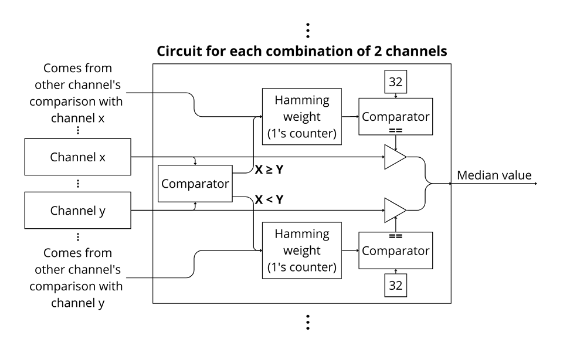

Specification of the MARTIn chip
###################################

Several high energy physics experiments suffer from coherent noise affecting their readout electronics. \
To solve that, the highly successful SAMPA chip is gaining a new successor, the SALSA front-end readout ASIC, \
which is going to be used in the EIC experiment of the Brookhaven National Laboratory, \
United States. This new integrated circuit is going to have a common mode noise subtraction, a non-linear filter \
that is based on finding median values between the many channels of the chip.

To meet those requirements a innovative median finder algorithm was implemented in hardware.

The proposed method to find the median value, considering a chip with 64 channels,  is based on the fact the median value \
(here assumed as the 33rd greatest value of the data collection) is bigger than 32 other \
 values. Therefore, by comparing every two channels in a combinatorial manner resulting in 2016 \
 comparisons, we can calculate for each channel value how many channels have \
 smaller samples. With that, there should be a channel that has 0 samples smaller than him \
 all the way to a channel that has 63 samples smaller than him. So the channel whose number of \
 smaller samples is 32 should be the 33rd greatest number, in other words, the wanted median.

With the hardware implementation in mind, each channel has three individual components: \
a Hamming weight component (counts the number of ones in its input) and a comparator \
 that compares the output of the 1’s counter with 32. Furthermore there are 2016 comparators, \
 one for every combination of two channels (channel X and Y). This comparator has two \
 outputs one for X ≥ Y and other for X < Y. The first output goes to the 1’s counter of the \
 channel X and the other goes to the 1’s counter of the Y channel. With that circuitry, the \
 1’s counter of each channel counts the number of channels with smaller samples, that \
 number goes to comparator of that channel, and if it is equal to 32, this channel is the one \
 that contains the median value and therefore should be the output.

With the intent to test this algoritm, the team proposed a smaller chip with only 8 channels, each with \
8 bits to test the proposed design. The is inserted in MARTIn chip in a simple filter format, with the \
possibility to subract the median value of the input. Also, this chip encompasses LFSR to test chip speeds \
and a 200 bytes shift register to test radiation tolerance. 

